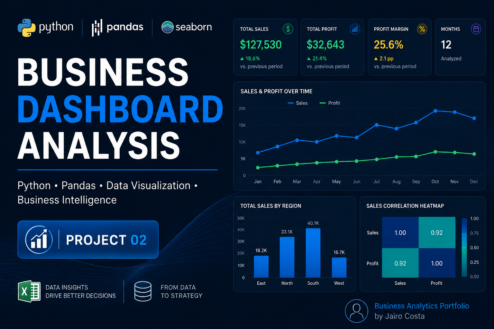

# Business Dashboard Analysis



## Project Overview

This project simulates a business analytics workflow using Python, Pandas, NumPy, Matplotlib, and Seaborn.

The objective is to analyze business sales and profit performance, generate executive insights, create visual dashboards, and export processed data for reporting purposes.

---

## Technologies Used

- Python
- Pandas
- NumPy
- Matplotlib
- Seaborn
- OpenPyXL
- Jupyter Notebook

---

## Business Objectives

The project focuses on:

- Sales performance analysis
- Profitability analysis
- Regional sales comparison
- Executive KPI generation
- Data visualization
- Automated business recommendations

---

## Dataset Structure

The dataset contains:

- Month
- Region
- Sales
- Profit

---

## Key Analysis Performed

### Data Exploration
- DataFrame creation
- Dataset inspection
- Statistical summary
- Data type analysis

### Business KPIs
- Total sales
- Total profit
- Profit margin

### Data Visualization
- Sales and profit trend analysis
- Regional sales comparison
- Correlation heatmap
- Dual-axis business chart

### Export Operations
- Exporting charts as PNG
- Exporting processed data to Excel

---

## Key Business Insights

- Strong positive correlation between Sales and Profit
- Healthy profit margin identified
- Consistent sales growth trend
- Regional performance differences detected

---

## Executive Recommendation

The company demonstrates strong profitability and operational efficiency.

It is recommended to maintain the current growth strategy while exploring expansion opportunities in high-performing regions.

---

## Generated Files

### Exported Excel File
`data/business_dashboard_data.xlsx`

### Exported Chart
`images/regional_sales_chart.png`

---

## Project Structure

```plaintext
project-02-business-dashboard/
│
├── data/
│   └── business_dashboard_data.xlsx
│
├── images/
│   └── regional_sales_chart.png
│
├── notebooks/
│   └── business_dashboard_analysis.ipynb
│
├── README.md
└── requirements.txt
```

---

## How to Run the Project

Clone the repository:

```bash
git clone https://github.com/jairo-costa/project-02-business-dashboard.git
```

Install dependencies:

```bash
pip install -r requirements.txt
```

Run Jupyter Notebook:

```bash
jupyter notebook
```

---

## Final Conclusion

This project demonstrates practical skills in:

- Business Analytics
- Data Visualization
- KPI Development
- Executive Reporting
- Python Data Analysis Workflow

The notebook was developed as a portfolio project focused on real-world business analysis scenarios.